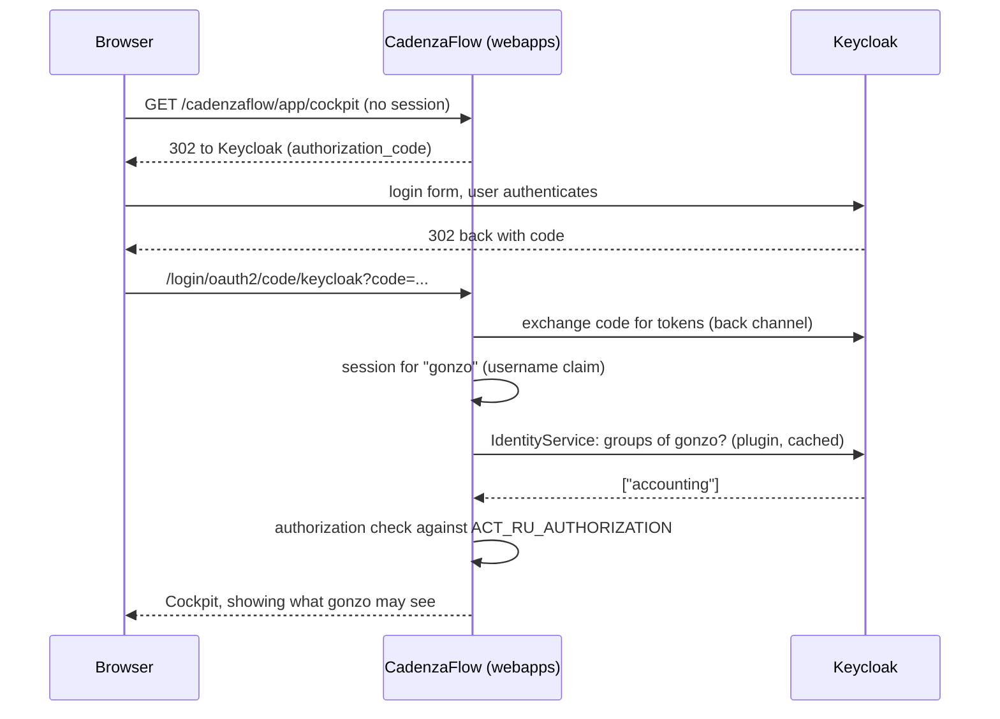
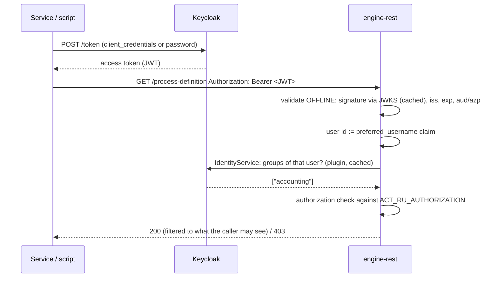

# Identity and authorization in CadenzaFlow with Keycloak

How a CadenzaFlow installation that uses Keycloak (this plugin + the OIDC
integrations) decides **who you are** and **what you may do** — for both the
webapps (Cockpit/Tasklist/Admin) and the REST API. Written for engineers who
are integrating against CadenzaFlow and thinking in OAuth2/OIDC terms.

The single most important sentence:

> **The access token authenticates; Keycloak *groups* authorize. Roles inside
> the token are never consulted.**

Everything below explains what that means mechanically, why it is built that
way, and how to work with it.

---

## 1. The three layers

| Layer | Question it answers | Implemented by | Input |
|---|---|---|---|
| **Authentication** | *Who is making this call?* | OIDC login (webapps) / Bearer token validation (REST) | the access/ID token |
| **Identity** | *Which groups is this user in?* | `cadenzaflow-keycloak` engine plugin (read-only federation) | live Keycloak Admin API queries (cached) |
| **Authorization** | *May this user/group do this?* | the engine's own authorization layer (`ACT_RU_AUTHORIZATION`) | grants written once per group |

The token only plays a role in the first layer. Layers 2 and 3 are completely
token-independent — which is exactly why a user in Cockpit and a service
calling `engine-rest` are subject to **the same rules**.

## 2. What the token is used for — and what it is not

A Keycloak access token typically contains, among others:

```json
{
  "preferred_username": "gonzo",
  "realm_access":    { "roles": ["invoice-clerk", "offline_access"] },
  "resource_access": { "my-client": { "roles": ["viewer"] } },
  "aud": "...", "azp": "...", "iss": "...", "exp": ...
}
```

CadenzaFlow reads: `preferred_username` (or the claim you configure) to know
**who** — plus the standard validity claims (`iss`, `exp`, `aud`/`azp`,
signature). CadenzaFlow does **not** read: `realm_access.roles`,
`resource_access.*.roles`, or any group claim you might map into the token.
Roles ride along in the token and are simply ignored.

If your organization models permissions as Keycloak **roles**, see
[§7](#7-i-have-roles-in-keycloak--what-now).

## 3. Flow A — browser SSO (webapps)



Notes:

* The login itself is standard Spring Security `authorization_code` — the
  oauth2 module ships with CadenzaFlow (`--oauth2` in Run) and activates as
  soon as a client registration is configured.
* Cockpit's user/group pickers, `group?member=...` queries etc. all go through
  the plugin — **the engine database contains no users and no groups**
  (read-only federation; `ACT_ID_*` tables stay empty).

## 4. Flow B — REST call with a Bearer token



Notes:

* Token validation is **offline** — no per-request call to Keycloak. The JWKS
  (public keys) are fetched once and cached; `iss`, `exp`/`nbf`, signature,
  algorithm and audience are checked locally.
* Configuration is two required `web.xml` init-params
  (`keycloak.issuer-uri`, `keycloak.audience`) on the standard
  `ProcessEngineAuthenticationFilter`; see the *engine-rest* README, section
  "OIDC Bearer Authentication (Keycloak)", for the full parameter table. A
  `CompositeAuthenticationProvider` allows Bearer **and** HTTP Basic side by
  side during migration.
* `client_credentials` vs `password` makes no difference to the server — both
  end in a JWT whose username claim identifies the caller.

## 5. Where permissions live and how to grant them

Permissions are rows in the engine's `ACT_RU_AUTHORIZATION` table (only
consulted when `cadenzaflow.bpm.authorization.enabled: true`). Each row says:
GRANT/REVOKE — for a user or a **group** — on a resource type (process
definition, task, application, …), a resource id (or `*`) — a set of
permissions (READ, CREATE_INSTANCE, ALL, …).

You write these rows **once per group**, not per user:

* **Admin group — automatic.** The plugin's `administratorGroupName` config
  seeds GRANT/ALL rows on every resource for that one group at first boot
  (log lines `KEYCLOAK-01002 GRANT group ...`). Members of that Keycloak
  group are full admins, immediately.
* **Every other group — once, by an admin**, either in the Admin webapp
  (*Authorizations* section) or via REST:

  ```bash
  POST /engine-rest/authorization
  { "type": 1, "permissions": ["READ", "CREATE_INSTANCE"],
    "groupId": "accounting", "resourceType": 6, "resourceId": "invoice-process" }
  ```

* **Group ids:** by default groups are identified by their Keycloak UUID. If
  you plan to write authorization rows by hand or in scripts, set
  `useGroupPathAsCamundaGroupId: true` in the plugin — group ids then become
  the readable group path (`accounting`). The Admin webapp's picker works
  either way.

Granularity is the engine's own: per process definition, per task, per
deployment, per resource type — far finer than endpoint-level role checks.

## 6. Machine clients get permissions the same way

A `client_credentials` token belongs to the client's **service account
user** (`service-account-<clientId>`) — which is a real user in the realm and
**can be put into groups** like any human. So:

1. In Keycloak: add `service-account-invoice-service` to the `accounting`
   group.
2. Done — the service now has exactly the permissions granted to
   `accounting`, through the same three layers as a human user.

One permission model for people and machines.

## 7. "I have ROLES in Keycloak — what now?"

Keycloak roles do not cross into CadenzaFlow at all: they do not appear in
Cockpit, are not returned by group queries, and play no part in authorization.
Two practical bridges:

* **Model each role as a group** (recommended). Create a group per
  role-concept, put users (and service accounts) in. If other systems consume
  your Keycloak *roles*, keep them: Keycloak lets you attach role mappings to
  a **group**, so membership in one group can simultaneously drive the role
  claims other systems read *and* the group CadenzaFlow reads. One membership,
  both worlds.
* **If "whatever the token says is the permission" is a hard requirement**
  (stateless authorization from token claims, no engine authorization rows):
  that is **deliberately not implemented**. Talk to the CadenzaFlow team with
  your concrete claim layout before building around that assumption — it
  would be a scoped extension of the Bearer provider, not a configuration
  option.

## 8. Why groups-from-the-source instead of roles-from-the-token?

* **Instant revocation.** Membership is read live (cached) from Keycloak. If
  you remove a user from a group, their permissions drop on the next request —
  **even though their token is still valid**. In a token-role model, revoked
  permissions survive until the token expires.
* **One source of truth for UI and API.** Cockpit and `engine-rest` resolve
  identity through the same plugin — there is no way for the UI and the API
  to disagree about someone's access.
* **Engine-grade granularity.** Authorization rows can target a single
  process definition or task; token roles would flatten this to coarse
  endpoint checks.
* **No token bloat / no mapper drift.** Nothing needs to be mapped into
  tokens, so there is nothing to keep in sync as permissions evolve.

The trade-off is honest: layer 2 needs Keycloak to be reachable (mitigated by
the plugin's cache), and permissions live in the engine DB rather than in the
token. For a BPM engine with its own fine-grained authorization model, that
is the natural place for them.

## 9. Operational lifecycle (day 2)

After the one-time setup you administer everything in Keycloak:

| Event | Action | Effect in CadenzaFlow |
|---|---|---|
| New employee | add to group(s) in Keycloak | permissions active on next request |
| Employee leaves | disable user / remove from groups | access gone on next request, valid token or not |
| New microservice | client + service account → into a group | same permissions as the group |
| New permission need | one grant to the group (Admin UI/REST) | applies to all members at once |

Cache note: the plugin caches Keycloak query results (configurable, see the
caching section of the main README); membership changes propagate within the
cache TTL.

## 10. Pointers

* **Try it in 5 minutes:** [`examples/run-sso-docker/`](../examples/run-sso-docker/) —
  `docker compose up --build`, demo realm with an admin and a regular user.
* **Set it up on your own Run:** Quickstart in the [repository README](../README.md).
* **Protect engine-rest:** *engine-rest* README in `cadenzaflow-bpm-platform`,
  section "OIDC Bearer Authentication (Keycloak)".
* **All plugin configuration options:** reference section of the
  [repository README](../README.md).
